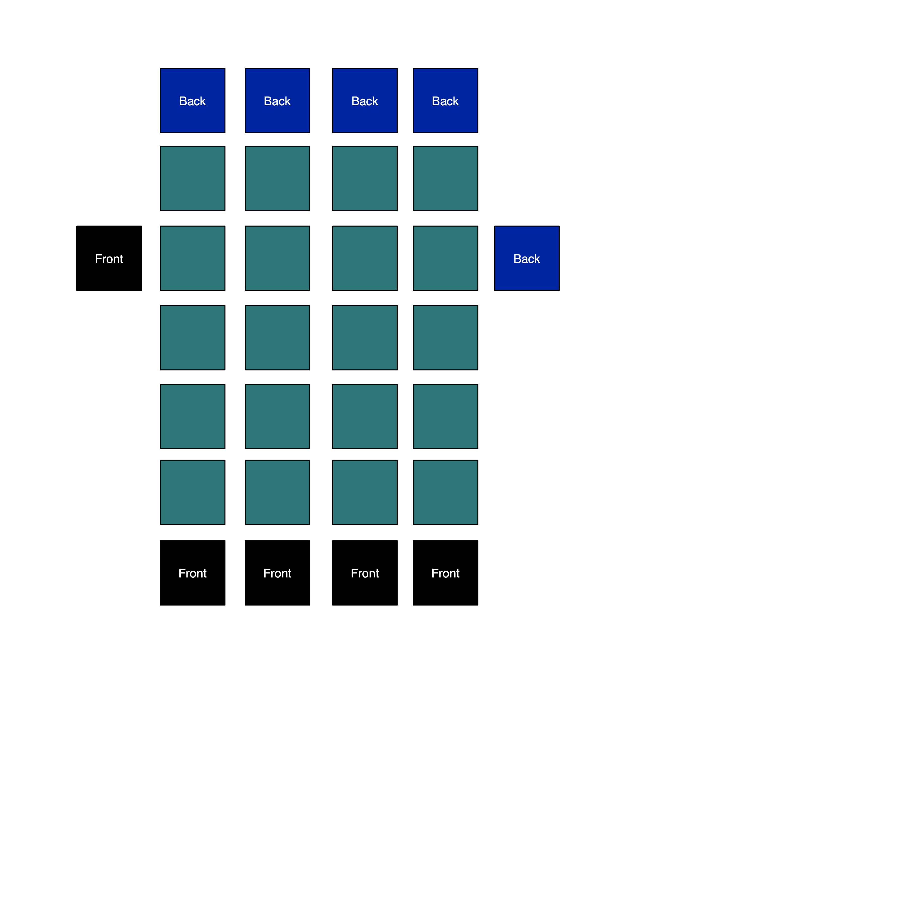

# TwoStack library

TwoStack library is a Golang implementation of 2-dimentional double-ended stack data primitive. The core of this data structure is a double-ended stack With "Front" node and "Back" node. Each node of this stack, called a 
"Global stack" is a double-ended stack, again with "Front" and "Back". This stack is called a "Cell stack"

